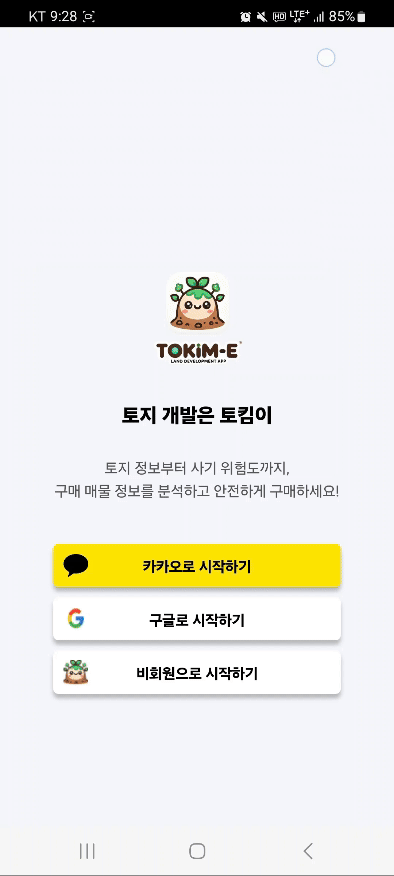
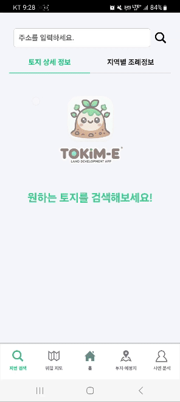
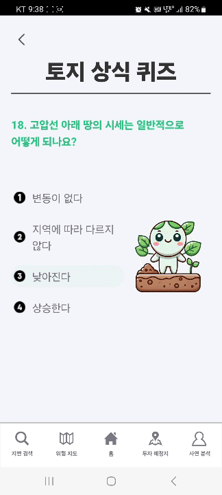
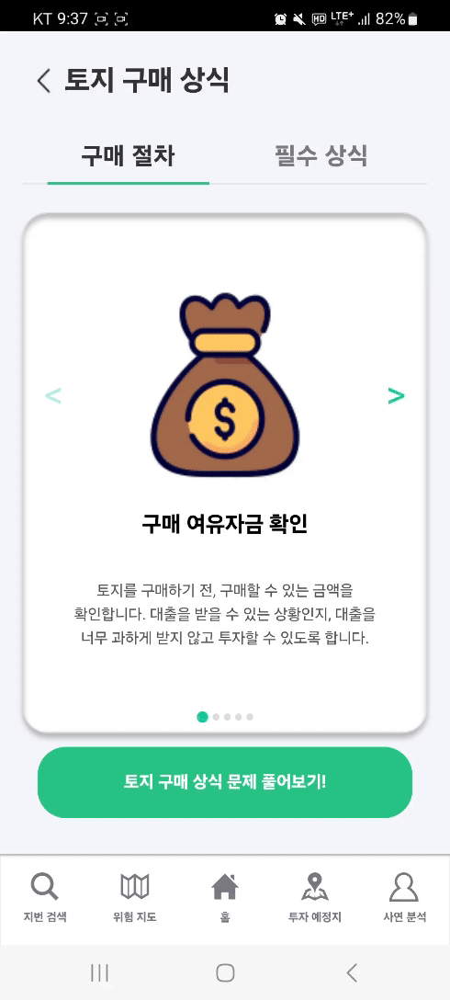
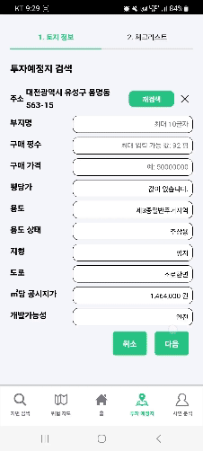
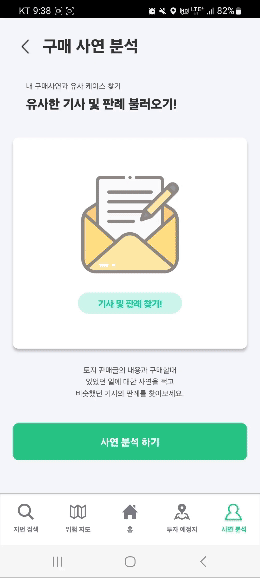
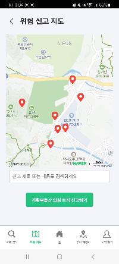

<div align="center">

</div>

<div align="center">
<h1>Tokim-E :city_sunset: 토지매입사기방지서비스</h1> 
</div>

**SSAFY 11기 2학기 특화 프로젝트**

<details>
<summary>시연 영상 링크</summary>
<div markdown="0"  align="center">

[](https://youtu.be/09fVQTDObuY) 
</div>
</details>

>**개발기간: 24.08.19~24.10.11**

## 개발팀 소개

| 허지영 (BACK) | 안해찬 (BACK) | 석재륜 (BACK) |
| --- | --- | --- | 
| ||
| [@jiyoung-Heo](https://github.com/jiyoung-Heo) |  [@BigCuteMan](https://github.com/BigCuteMan) | [@seokjr](https://github.com/seokjr) |

| 김선옥 (BACK) | 이정원 (FRONT) | 정규영 (FRONT) |
| --- | --- | --- |
| ||
| [@kso8760](https://github.com/kso8760) |  [@jw17111](https://github.com/jw17111) | [@JungGyuYeong](https://github.com/JungGyuYeong) |


## 기술 스택, 빌드 버전 및 기타 도구


### Frontend
 


### Backend
 
 
 
 


### Infra


### 기타 도구
 
 


### 버전
<details>
<summary>version</summary>
<div markdown="1">

```text
- React: 5.0.1
- Spring boot: 3.3.3
- MySQL: 8
- Redis: 7.4
- Nginx: 1.27.1
- AWS EC2 Ubuntu: 20.04.6 LTS
- Jenkins: 2.452.3
- Docker: 27.2.1
- Docker-compose: 1.29.2
- jdk: 17, 11
- gradle: 8.10
- Hadoop: 3.4.0
- Elasticsearch: 8.15.1
- Kibana: 8.15.1
- Visual Studio Code: 1.90.2
- IntelliJ IDEA: 2024.1.4
```
</div>
</details>

## 디렉토리 구조
<details>
<summary>back-end</summary>
<div markdown="1">

```text
📦back-end
 ┣ 📂.idea
 ┃ ┣ 📂modules
 ┃ ┃ ┗ 📜tokime.main.iml
 ┃ ┣ 📜.gitignore
 ┃ ┣ 📜back-end.iml
 ┃ ┣ 📜compiler.xml
 ┃ ┣ 📜encodings.xml
 ┃ ┣ 📜gradle.xml
 ┃ ┣ 📜jarRepositories.xml
 ┃ ┣ 📜misc.xml
 ┃ ┣ 📜modules.xml
 ┃ ┗ 📜vcs.xml
 ┗ 📂tokime
 ┃ ┣ 📂.gradle
 ┃ ┃ ┣ 📂8.10
 ┃ ┃ ┣ 📂buildOutputCleanup
 ┃ ┃ ┗ 📂vcs-1
 ┃ ┣ 📂.idea
 ┃ ┃ ┣ 📂modules
 ┃ ┣ 📂gradle
 ┃ ┃ ┗ 📂wrapper
 ┃ ┃ ┃ ┗ 📜gradle-wrapper.properties
 ┃ ┣ 📂src
 ┃ ┃ ┣ 📂main
 ┃ ┃ ┃ ┣ 📂java
 ┃ ┃ ┃ ┃ ┗ 📂com
 ┃ ┃ ┃ ┃ ┃ ┗ 📂ssafy
 ┃ ┃ ┃ ┃ ┃ ┃ ┗ 📂tokime
 ┃ ┃ ┃ ┃ ┃ ┃ ┃ ┣ 📂config
 ┃ ┃ ┃ ┃ ┃ ┃ ┃ ┃ ┣ 📜QueryDSLConfig.java
 ┃ ┃ ┃ ┃ ┃ ┃ ┃ ┃ ┣ 📜ServerConfig.java
 ┃ ┃ ┃ ┃ ┃ ┃ ┃ ┃ ┗ 📜SwaggerConfig.java
 ┃ ┃ ┃ ┃ ┃ ┃ ┃ ┣ 📂controller
 ┃ ┃ ┃ ┃ ┃ ┃ ┃ ┃ ┣ 📜DangerController.java
 ┃ ┃ ┃ ┃ ┃ ┃ ┃ ┃ ┣ 📜InvestmentPlannedLandController.java
 ┃ ┃ ┃ ┃ ┃ ┃ ┃ ┃ ┣ 📜LandController.java
 ┃ ┃ ┃ ┃ ┃ ┃ ┃ ┃ ┣ 📜LandknowledgeController.java
 ┃ ┃ ┃ ┃ ┃ ┃ ┃ ┃ ┣ 📜QuizController.java
 ┃ ┃ ┃ ┃ ┃ ┃ ┃ ┃ ┣ 📜StoryController.java
 ┃ ┃ ┃ ┃ ┃ ┃ ┃ ┃ ┣ 📜UserController.java
 ┃ ┃ ┃ ┃ ┃ ┃ ┃ ┃ ┗ 📜WordController.java
 ┃ ┃ ┃ ┃ ┃ ┃ ┃ ┣ 📂dto
 ┃ ┃ ┃ ┃ ┃ ┃ ┃ ┃ ┣ 📜ChecklistDTO.java
 ┃ ┃ ┃ ┃ ┃ ┃ ┃ ┃ ┣ 📜ChecklistStatusDTO.java
 ┃ ┃ ┃ ┃ ┃ ┃ ┃ ┃ ┣ 📜InvestmentPlannedLandDTO.java
 ┃ ┃ ┃ ┃ ┃ ┃ ┃ ┃ ┣ 📜LandDTO.java
 ┃ ┃ ┃ ┃ ┃ ┃ ┃ ┃ ┣ 📜LandFilterDTO.java
 ┃ ┃ ┃ ┃ ┃ ┃ ┃ ┃ ┣ 📜LandknowledgeDTO.java
 ┃ ┃ ┃ ┃ ┃ ┃ ┃ ┃ ┣ 📜LandtermDTO.java
 ┃ ┃ ┃ ┃ ┃ ┃ ┃ ┃ ┣ 📜LawDTO.java
 ┃ ┃ ┃ ┃ ┃ ┃ ┃ ┃ ┣ 📜LawSearchDTO.java
 ┃ ┃ ┃ ┃ ┃ ┃ ┃ ┃ ┣ 📜LikeWordDTO.java
 ┃ ┃ ┃ ┃ ┃ ┃ ┃ ┃ ┣ 📜QuizAverageDTO.java
 ┃ ┃ ┃ ┃ ┃ ┃ ┃ ┃ ┣ 📜QuizDTO.java
 ┃ ┃ ┃ ┃ ┃ ┃ ┃ ┃ ┣ 📜ResponseDTO.java
 ┃ ┃ ┃ ┃ ┃ ┃ ┃ ┃ ┣ 📜StoryDTO.java
 ┃ ┃ ┃ ┃ ┃ ┃ ┃ ┃ ┗ 📜UserDTO.java
 ┃ ┃ ┃ ┃ ┃ ┃ ┃ ┣ 📂model
 ┃ ┃ ┃ ┃ ┃ ┃ ┃ ┃ ┣ 📜BaseEntity.java
 ┃ ┃ ┃ ┃ ┃ ┃ ┃ ┃ ┣ 📜Checklist.java
 ┃ ┃ ┃ ┃ ┃ ┃ ┃ ┃ ┣ 📜ChecklistStatus.java
 ┃ ┃ ┃ ┃ ┃ ┃ ┃ ┃ ┣ 📜Danger.java
 ┃ ┃ ┃ ┃ ┃ ┃ ┃ ┃ ┣ 📜InvestmentPlannedLand.java
 ┃ ┃ ┃ ┃ ┃ ┃ ┃ ┃ ┣ 📜Land.java
 ┃ ┃ ┃ ┃ ┃ ┃ ┃ ┃ ┣ 📜Landknowledge.java
 ┃ ┃ ┃ ┃ ┃ ┃ ┃ ┃ ┣ 📜Landterm.java
 ┃ ┃ ┃ ┃ ┃ ┃ ┃ ┃ ┣ 📜Law.java
 ┃ ┃ ┃ ┃ ┃ ┃ ┃ ┃ ┣ 📜Likeword.java
 ┃ ┃ ┃ ┃ ┃ ┃ ┃ ┃ ┣ 📜Quiz.java
 ┃ ┃ ┃ ┃ ┃ ┃ ┃ ┃ ┣ 📜QuizCorrect.java
 ┃ ┃ ┃ ┃ ┃ ┃ ┃ ┃ ┣ 📜QuizIncorrect.java
 ┃ ┃ ┃ ┃ ┃ ┃ ┃ ┃ ┣ 📜QuizTotal.java
 ┃ ┃ ┃ ┃ ┃ ┃ ┃ ┃ ┣ 📜Story.java
 ┃ ┃ ┃ ┃ ┃ ┃ ┃ ┃ ┗ 📜User.java
 ┃ ┃ ┃ ┃ ┃ ┃ ┃ ┣ 📂repository
 ┃ ┃ ┃ ┃ ┃ ┃ ┃ ┃ ┣ 📜ChecklistRepository.java
 ┃ ┃ ┃ ┃ ┃ ┃ ┃ ┃ ┣ 📜ChecklistStatusRepository.java
 ┃ ┃ ┃ ┃ ┃ ┃ ┃ ┃ ┣ 📜DangerRepository.java
 ┃ ┃ ┃ ┃ ┃ ┃ ┃ ┃ ┣ 📜InvestmentPlannedLandRepository.java
 ┃ ┃ ┃ ┃ ┃ ┃ ┃ ┃ ┣ 📜LandknowledgeRepository.java
 ┃ ┃ ┃ ┃ ┃ ┃ ┃ ┃ ┣ 📜LandRepository.java
 ┃ ┃ ┃ ┃ ┃ ┃ ┃ ┃ ┣ 📜LawRepository.java
 ┃ ┃ ┃ ┃ ┃ ┃ ┃ ┃ ┣ 📜LikeWordRepository.java
 ┃ ┃ ┃ ┃ ┃ ┃ ┃ ┃ ┣ 📜QuizCorrectRepository.java
 ┃ ┃ ┃ ┃ ┃ ┃ ┃ ┃ ┣ 📜QuizInCorrectRepository.java
 ┃ ┃ ┃ ┃ ┃ ┃ ┃ ┃ ┣ 📜QuizRepository.java
 ┃ ┃ ┃ ┃ ┃ ┃ ┃ ┃ ┣ 📜StoryRepository.java
 ┃ ┃ ┃ ┃ ┃ ┃ ┃ ┃ ┣ 📜UserRepository.java
 ┃ ┃ ┃ ┃ ┃ ┃ ┃ ┃ ┗ 📜WordRepository.java
 ┃ ┃ ┃ ┃ ┃ ┃ ┃ ┣ 📂security
 ┃ ┃ ┃ ┃ ┃ ┃ ┃ ┃ ┣ 📂config
 ┃ ┃ ┃ ┃ ┃ ┃ ┃ ┃ ┃ ┣ 📜RedisConfig.java
 ┃ ┃ ┃ ┃ ┃ ┃ ┃ ┃ ┃ ┗ 📜SecurityConfig.java
 ┃ ┃ ┃ ┃ ┃ ┃ ┃ ┃ ┣ 📂dto
 ┃ ┃ ┃ ┃ ┃ ┃ ┃ ┃ ┃ ┣ 📜CustomOAuth2User.java
 ┃ ┃ ┃ ┃ ┃ ┃ ┃ ┃ ┃ ┣ 📜CustomUserDetails.java
 ┃ ┃ ┃ ┃ ┃ ┃ ┃ ┃ ┃ ┣ 📜GeneratedToken.java
 ┃ ┃ ┃ ┃ ┃ ┃ ┃ ┃ ┃ ┣ 📜GoogleResponse.java
 ┃ ┃ ┃ ┃ ┃ ┃ ┃ ┃ ┃ ┣ 📜KakaoResponse.java
 ┃ ┃ ┃ ┃ ┃ ┃ ┃ ┃ ┃ ┣ 📜OAuth2Response.java
 ┃ ┃ ┃ ┃ ┃ ┃ ┃ ┃ ┃ ┣ 📜ResponseDTO.java
 ┃ ┃ ┃ ┃ ┃ ┃ ┃ ┃ ┃ ┣ 📜StatusResponseDto.java
 ┃ ┃ ┃ ┃ ┃ ┃ ┃ ┃ ┃ ┣ 📜TokenResponseStatusDto.java
 ┃ ┃ ┃ ┃ ┃ ┃ ┃ ┃ ┃ ┗ 📜UserDTO.java
 ┃ ┃ ┃ ┃ ┃ ┃ ┃ ┃ ┣ 📂jwt
 ┃ ┃ ┃ ┃ ┃ ┃ ┃ ┃ ┃ ┣ 📜JwtFilter.java
 ┃ ┃ ┃ ┃ ┃ ┃ ┃ ┃ ┃ ┗ 📜JwtUtil.java
 ┃ ┃ ┃ ┃ ┃ ┃ ┃ ┃ ┣ 📂model
 ┃ ┃ ┃ ┃ ┃ ┃ ┃ ┃ ┃ ┗ 📜RefreshToken.java
 ┃ ┃ ┃ ┃ ┃ ┃ ┃ ┃ ┣ 📂oauth2
 ┃ ┃ ┃ ┃ ┃ ┃ ┃ ┃ ┃ ┣ 📜CustomLogoutHandler.java
 ┃ ┃ ┃ ┃ ┃ ┃ ┃ ┃ ┃ ┣ 📜CustomOAuth2SuccessHandler.java
 ┃ ┃ ┃ ┃ ┃ ┃ ┃ ┃ ┃ ┗ 📜CustomUserFailureHandler.java
 ┃ ┃ ┃ ┃ ┃ ┃ ┃ ┃ ┣ 📂repository
 ┃ ┃ ┃ ┃ ┃ ┃ ┃ ┃ ┃ ┗ 📜RefreshTokenRepository.java
 ┃ ┃ ┃ ┃ ┃ ┃ ┃ ┃ ┣ 📂service
 ┃ ┃ ┃ ┃ ┃ ┃ ┃ ┃ ┃ ┣ 📜CustomOAuth2UserService.java
 ┃ ┃ ┃ ┃ ┃ ┃ ┃ ┃ ┃ ┗ 📜RefreshTokenService.java
 ┃ ┃ ┃ ┃ ┃ ┃ ┃ ┃ ┗ 📂util
 ┃ ┃ ┃ ┃ ┃ ┃ ┃ ┃ ┃ ┗ 📜ROLE.java
 ┃ ┃ ┃ ┃ ┃ ┃ ┃ ┣ 📂service
 ┃ ┃ ┃ ┃ ┃ ┃ ┃ ┃ ┣ 📂facade
 ┃ ┃ ┃ ┃ ┃ ┃ ┃ ┃ ┃ ┣ 📜LandknowledgeFacadeService.java
 ┃ ┃ ┃ ┃ ┃ ┃ ┃ ┃ ┃ ┗ 📜UserFacadeService.java
 ┃ ┃ ┃ ┃ ┃ ┃ ┃ ┃ ┣ 📜DangerService.java
 ┃ ┃ ┃ ┃ ┃ ┃ ┃ ┃ ┣ 📜InvestmentPlannedLandService.java
 ┃ ┃ ┃ ┃ ┃ ┃ ┃ ┃ ┣ 📜LandknowledgeService.java
 ┃ ┃ ┃ ┃ ┃ ┃ ┃ ┃ ┣ 📜LandService.java
 ┃ ┃ ┃ ┃ ┃ ┃ ┃ ┃ ┣ 📜LawService.java
 ┃ ┃ ┃ ┃ ┃ ┃ ┃ ┃ ┣ 📜QuizService.java
 ┃ ┃ ┃ ┃ ┃ ┃ ┃ ┃ ┣ 📜StoryService.java
 ┃ ┃ ┃ ┃ ┃ ┃ ┃ ┃ ┣ 📜UserService.java
 ┃ ┃ ┃ ┃ ┃ ┃ ┃ ┃ ┗ 📜WordService.java
 ┃ ┃ ┃ ┃ ┃ ┃ ┃ ┗ 📜TokimeApplication.java
 ┃ ┃ ┃ ┗ 📂resources
 ┃ ┃ ┃ ┃ ┣ 📜application-jwt.yml
 ┃ ┃ ┃ ┃ ┣ 📜application-oauth.yml
 ┃ ┃ ┃ ┃ ┣ 📜application-url.yml
 ┃ ┃ ┃ ┃ ┗ 📜application.properties
 ┃ ┃ ┗ 📂test
 ┃ ┃ ┃ ┗ 📂java
 ┃ ┃ ┃ ┃ ┗ 📂com
 ┃ ┃ ┃ ┃ ┃ ┗ 📂ssafy
 ┃ ┃ ┃ ┃ ┃ ┃ ┗ 📂tokime
 ┃ ┃ ┃ ┃ ┃ ┃ ┃ ┗ 📜TokimeApplicationTests.java
 ┃ ┣ 📜.gitignore
 ┃ ┣ 📜build.gradle
 ┃ ┣ 📜dockerfile
 ┃ ┣ 📜gradlew
 ┃ ┣ 📜gradlew.bat
 ┃ ┣ 📜HELP.md
 ┃ ┣ 📜jenkinsfile
 ┃ ┗ 📜settings.gradle
```

</div>
</details>
<details>
<summary>front-end</summary>
<div markdown="2">

```text
📦front-end
 ┗ 📂tokime
 ┃ ┣ 📂public
 ┃ ┃ ┣ 📂icons
 ┃ ┃ ┃ ┣ 📜checklisticon.svg
 ┃ ┃ ┃ ┣ 📜icon-192.png
 ┃ ┃ ┃ ┣ 📜icon-512.png
 ┃ ┃ ┃ ┣ 📜icon-64.png
 ┃ ┃ ┃ ┣ 📜icon-siren.png
 ┃ ┃ ┃ ┣ 📜icon-speaker.png
 ┃ ┃ ┃ ┣ 📜info.png
 ┃ ┃ ┃ ┗ 📜information.png
 ┃ ┃ ┣ 📂markers
 ┃ ┃ ┃ ┣ 📜caution.png
 ┃ ┃ ┃ ┣ 📜danger.png
 ┃ ┃ ┃ ┣ 📜default.png
 ┃ ┃ ┃ ┗ 📜report.png
 ┃ ┃ ┣ 📜favicon.ico
 ┃ ┃ ┣ 📜favicon2.ico
 ┃ ┃ ┣ 📜index.html
 ┃ ┃ ┣ 📜manifest.json
 ┃ ┃ ┗ 📜robots.txt
 ┃ ┣ 📂src
 ┃ ┃ ┣ 📂api
 ┃ ┃ ┃ ┣ 📜dangerAxios.ts
 ┃ ┃ ┃ ┣ 📜elasticLawsAxios.ts
 ┃ ┃ ┃ ┣ 📜elasticNewsAxios.ts
 ┃ ┃ ┃ ┣ 📜landAxios.ts
 ┃ ┃ ┃ ┣ 📜landInvestAxios.ts
 ┃ ┃ ┃ ┣ 📜LandPurchaseKnowledge.ts
 ┃ ┃ ┃ ┣ 📜logoutAxios.ts
 ┃ ┃ ┃ ┣ 📜modifyUserBirthAxios.ts
 ┃ ┃ ┃ ┣ 📜modifyUserQuizAxios.ts
 ┃ ┃ ┃ ┣ 📜quizListAxios.ts
 ┃ ┃ ┃ ┣ 📜storyAxios.ts
 ┃ ┃ ┃ ┣ 📜termAxios.ts
 ┃ ┃ ┃ ┣ 📜userInfoAxios.ts
 ┃ ┃ ┃ ┣ 📜userQuizAverageAxios.ts
 ┃ ┃ ┃ ┣ 📜userQuizAxios.ts
 ┃ ┃ ┃ ┣ 📜userQuizPercentAxios.ts
 ┃ ┃ ┃ ┗ 📜withdrawAxios.ts
 ┃ ┃ ┣ 📂assets
 ┃ ┃ ┃ ┗ 📂images
 ┃ ┃ ┃ ┃ ┣ 📂checklist
 ┃ ┃ ┃ ┃ ┃ ┣ 📜free-icon-warning-4931430.png
 ┃ ┃ ┃ ┃ ┃ ┣ 📜uncheck.png
 ┃ ┃ ┃ ┃ ┃ ┣ 📜체크리스트1.png
 ┃ ┃ ┃ ┃ ┃ ┣ 📜체크리스트10.png
 ┃ ┃ ┃ ┃ ┃ ┣ 📜체크리스트11.png
 ┃ ┃ ┃ ┃ ┃ ┣ 📜체크리스트2.png
 ┃ ┃ ┃ ┃ ┃ ┣ 📜체크리스트3.png
 ┃ ┃ ┃ ┃ ┃ ┣ 📜체크리스트4.png
 ┃ ┃ ┃ ┃ ┃ ┣ 📜체크리스트5.png
 ┃ ┃ ┃ ┃ ┃ ┣ 📜체크리스트6.png
 ┃ ┃ ┃ ┃ ┃ ┣ 📜체크리스트7.png
 ┃ ┃ ┃ ┃ ┃ ┣ 📜체크리스트8.png
 ┃ ┃ ┃ ┃ ┃ ┗ 📜체크리스트9.png
 ┃ ┃ ┃ ┃ ┣ 📂icon
 ┃ ┃ ┃ ┃ ┃ ┣ 📜1.png
 ┃ ┃ ┃ ┃ ┃ ┣ 📜2.png
 ┃ ┃ ┃ ┃ ┃ ┣ 📜3.png
 ┃ ┃ ┃ ┃ ┃ ┣ 📜4.png
 ┃ ┃ ┃ ┃ ┃ ┣ 📜beforestory.png
 ┃ ┃ ┃ ┃ ┃ ┣ 📜checklisticon.svg
 ┃ ┃ ┃ ┃ ┃ ┣ 📜chevron-left.png
 ┃ ┃ ┃ ┃ ┃ ┣ 📜chevron-right.png
 ┃ ┃ ┃ ┃ ┃ ┣ 📜commonsenseicon.png
 ┃ ┃ ┃ ┃ ┃ ┣ 📜dangericon.svg
 ┃ ┃ ┃ ┃ ┃ ┣ 📜dangermapicon.png
 ┃ ┃ ┃ ┃ ┃ ┣ 📜dictionary.png
 ┃ ┃ ┃ ┃ ┃ ┣ 📜echoballon.png
 ┃ ┃ ┃ ┃ ┃ ┣ 📜Google.png
 ┃ ┃ ┃ ┃ ┃ ┣ 📜home.svg
 ┃ ┃ ┃ ┃ ┃ ┣ 📜icon-map.png
 ┃ ┃ ┃ ┃ ┃ ┣ 📜icon-siren.png
 ┃ ┃ ┃ ┃ ┃ ┣ 📜icon-speaker.png
 ┃ ┃ ┃ ┃ ┃ ┣ 📜investicon.png
 ┃ ┃ ┃ ┃ ┃ ┣ 📜investment.svg
 ┃ ┃ ┃ ┃ ┃ ┣ 📜kakao.svg
 ┃ ┃ ┃ ┃ ┃ ┣ 📜law.png
 ┃ ┃ ┃ ┃ ┃ ┣ 📜left-actionable.png
 ┃ ┃ ┃ ┃ ┃ ┣ 📜loading.gif
 ┃ ┃ ┃ ┃ ┃ ┣ 📜map.png
 ┃ ┃ ┃ ┃ ┃ ┣ 📜map.svg
 ┃ ┃ ┃ ┃ ┃ ┣ 📜Multiply.png
 ┃ ┃ ┃ ┃ ┃ ┣ 📜okicon.svg
 ┃ ┃ ┃ ┃ ┃ ┣ 📜scoreicon.png
 ┃ ┃ ┃ ┃ ┃ ┣ 📜search.svg
 ┃ ┃ ┃ ┃ ┃ ┣ 📜searchmapicon.png
 ┃ ┃ ┃ ┃ ┃ ┣ 📜sidebar-icon.svg
 ┃ ┃ ┃ ┃ ┃ ┣ 📜sidebaremail.png
 ┃ ┃ ┃ ┃ ┃ ┣ 📜sidebarphone.png
 ┃ ┃ ┃ ┃ ┃ ┣ 📜sidebaruser.png
 ┃ ┃ ┃ ┃ ┃ ┣ 📜star.svg
 ┃ ┃ ┃ ┃ ┃ ┣ 📜star_filled.png
 ┃ ┃ ┃ ┃ ┃ ┣ 📜star_filled.svg
 ┃ ┃ ┃ ┃ ┃ ┣ 📜Tokime.png
 ┃ ┃ ┃ ┃ ┃ ┣ 📜user.svg
 ┃ ┃ ┃ ┃ ┃ ┣ 📜체크.png
 ┃ ┃ ┃ ┃ ┃ ┣ 📜체크.svg
 ┃ ┃ ┃ ┃ ┃ ┗ 📜체크x.png
 ┃ ┃ ┃ ┃ ┣ 📂knowledge
 ┃ ┃ ┃ ┃ ┃ ┣ 📜1.png
 ┃ ┃ ┃ ┃ ┃ ┣ 📜10.png
 ┃ ┃ ┃ ┃ ┃ ┣ 📜11.png
 ┃ ┃ ┃ ┃ ┃ ┣ 📜12.png
 ┃ ┃ ┃ ┃ ┃ ┣ 📜13.png
 ┃ ┃ ┃ ┃ ┃ ┣ 📜14.png
 ┃ ┃ ┃ ┃ ┃ ┣ 📜15.png
 ┃ ┃ ┃ ┃ ┃ ┣ 📜16.png
 ┃ ┃ ┃ ┃ ┃ ┣ 📜17.png
 ┃ ┃ ┃ ┃ ┃ ┣ 📜18.png
 ┃ ┃ ┃ ┃ ┃ ┣ 📜19.png
 ┃ ┃ ┃ ┃ ┃ ┣ 📜2.png
 ┃ ┃ ┃ ┃ ┃ ┣ 📜20.png
 ┃ ┃ ┃ ┃ ┃ ┣ 📜21.png
 ┃ ┃ ┃ ┃ ┃ ┣ 📜3.png
 ┃ ┃ ┃ ┃ ┃ ┣ 📜4.png
 ┃ ┃ ┃ ┃ ┃ ┣ 📜5.png
 ┃ ┃ ┃ ┃ ┃ ┣ 📜6.png
 ┃ ┃ ┃ ┃ ┃ ┣ 📜7.png
 ┃ ┃ ┃ ┃ ┃ ┣ 📜8.png
 ┃ ┃ ┃ ┃ ┃ ┗ 📜9.png
 ┃ ┃ ┃ ┃ ┣ 📂landInfo
 ┃ ┃ ┃ ┃ ┃ ┣ 📜gradient.png
 ┃ ┃ ┃ ┃ ┃ ┣ 📜money.png
 ┃ ┃ ┃ ┃ ┃ ┣ 📜percentage.png
 ┃ ┃ ┃ ┃ ┃ ┣ 📜purpose.png
 ┃ ┃ ┃ ┃ ┃ ┣ 📜road.png
 ┃ ┃ ┃ ┃ ┃ ┣ 📜scale.png
 ┃ ┃ ┃ ┃ ┃ ┗ 📜use.png
 ┃ ┃ ┃ ┃ ┣ 📂procedure
 ┃ ┃ ┃ ┃ ┃ ┣ 📜1.png
 ┃ ┃ ┃ ┃ ┃ ┣ 📜2.png
 ┃ ┃ ┃ ┃ ┃ ┣ 📜3.png
 ┃ ┃ ┃ ┃ ┃ ┣ 📜4.png
 ┃ ┃ ┃ ┃ ┃ ┗ 📜5.png
 ┃ ┃ ┃ ┃ ┣ 📂quiz
 ┃ ┃ ┃ ┃ ┃ ┣ 📜토킴이10누끼.png
 ┃ ┃ ┃ ┃ ┃ ┣ 📜토킴이11누끼.png
 ┃ ┃ ┃ ┃ ┃ ┣ 📜토킴이12누끼.png
 ┃ ┃ ┃ ┃ ┃ ┣ 📜토킴이13누끼.png
 ┃ ┃ ┃ ┃ ┃ ┣ 📜토킴이14누끼.png
 ┃ ┃ ┃ ┃ ┃ ┣ 📜토킴이15누끼.png
 ┃ ┃ ┃ ┃ ┃ ┣ 📜토킴이16누끼.png
 ┃ ┃ ┃ ┃ ┃ ┣ 📜토킴이17누끼.png
 ┃ ┃ ┃ ┃ ┃ ┣ 📜토킴이18누끼.png
 ┃ ┃ ┃ ┃ ┃ ┣ 📜토킴이19누끼.png
 ┃ ┃ ┃ ┃ ┃ ┣ 📜토킴이1누끼.png
 ┃ ┃ ┃ ┃ ┃ ┣ 📜토킴이20누끼.png
 ┃ ┃ ┃ ┃ ┃ ┣ 📜토킴이2누끼.png
 ┃ ┃ ┃ ┃ ┃ ┣ 📜토킴이3누끼.png
 ┃ ┃ ┃ ┃ ┃ ┣ 📜토킴이4누끼.png
 ┃ ┃ ┃ ┃ ┃ ┣ 📜토킴이5누끼.png
 ┃ ┃ ┃ ┃ ┃ ┣ 📜토킴이6누끼.png
 ┃ ┃ ┃ ┃ ┃ ┣ 📜토킴이7누끼.png
 ┃ ┃ ┃ ┃ ┃ ┣ 📜토킴이8누끼.png
 ┃ ┃ ┃ ┃ ┃ ┗ 📜토킴이9누끼.png
 ┃ ┃ ┃ ┃ ┣ 📂score
 ┃ ┃ ┃ ┃ ┃ ┣ 📜even.png
 ┃ ┃ ┃ ┃ ┃ ┣ 📜forest.png
 ┃ ┃ ┃ ┃ ┃ ┣ 📜high.png
 ┃ ┃ ┃ ┃ ┃ ┣ 📜land.png
 ┃ ┃ ┃ ┃ ┃ ┣ 📜login.png
 ┃ ┃ ┃ ┃ ┃ ┣ 📜low.png
 ┃ ┃ ┃ ┃ ┃ ┣ 📜sprout.png
 ┃ ┃ ┃ ┃ ┃ ┗ 📜tree.png
 ┃ ┃ ┃ ┃ ┣ 📜land1.png
 ┃ ┃ ┃ ┃ ┣ 📜land2.png
 ┃ ┃ ┃ ┃ ┣ 📜mail.png
 ┃ ┃ ┃ ┃ ┣ 📜mung.gif
 ┃ ┃ ┃ ┃ ┣ 📜news.png
 ┃ ┃ ┃ ┃ ┣ 📜TokimEnglogo.png
 ┃ ┃ ┃ ┃ ┗ 📜Tokimlogo.png
 ┃ ┃ ┣ 📂components
 ┃ ┃ ┃ ┣ 📂charts
 ┃ ┃ ┃ ┃ ┣ 📜ChartComponents.tsx
 ┃ ┃ ┃ ┃ ┗ 📜GaugeGraph.tsx
 ┃ ┃ ┃ ┣ 📂layouts
 ┃ ┃ ┃ ┃ ┣ 📜BottomTab.tsx
 ┃ ┃ ┃ ┃ ┣ 📜layout.tsx
 ┃ ┃ ┃ ┃ ┣ 📜LoadingSpinner.tsx
 ┃ ┃ ┃ ┃ ┗ 📜Sidebar.tsx
 ┃ ┃ ┃ ┣ 📂modals
 ┃ ┃ ┃ ┃ ┣ 📜DeleteModal.tsx
 ┃ ┃ ┃ ┃ ┣ 📜LandInformationRegistrationModal.tsx
 ┃ ┃ ┃ ┃ ┣ 📜LawDetailModal.tsx
 ┃ ┃ ┃ ┃ ┣ 📜PrecedentDetailModal.tsx
 ┃ ┃ ┃ ┃ ┣ 📜PreviousStoryModal.tsx
 ┃ ┃ ┃ ┃ ┗ 📜RiskMapModal.tsx
 ┃ ┃ ┃ ┣ 📂Tabs
 ┃ ┃ ┃ ┃ ┣ 📜AnalysisTab.tsx
 ┃ ┃ ┃ ┃ ┣ 📜ChecklistRegistrationTab.tsx
 ┃ ┃ ┃ ┃ ┣ 📜ChecklistTab.tsx
 ┃ ┃ ┃ ┃ ┣ 📜EssentialKnowledgeTab.tsx
 ┃ ┃ ┃ ┃ ┣ 📜InvestmentDetailTab.tsx
 ┃ ┃ ┃ ┃ ┣ 📜LandDetailTab.tsx
 ┃ ┃ ┃ ┃ ┣ 📜LandInformationRegistrationTab.tsx
 ┃ ┃ ┃ ┃ ┣ 📜LandInformationTab.tsx
 ┃ ┃ ┃ ┃ ┣ 📜LandPurchaseProcedureTab.tsx
 ┃ ┃ ┃ ┃ ┣ 📜MyLandScoreTab.tsx
 ┃ ┃ ┃ ┃ ┣ 📜NaverMap.tsx
 ┃ ┃ ┃ ┃ ┣ 📜NaverMapProps.tsx
 ┃ ┃ ┃ ┃ ┣ 📜OrdinanceInfoTab.tsx
 ┃ ┃ ┃ ┃ ┣ 📜RiskMapTab.tsx
 ┃ ┃ ┃ ┃ ┣ 📜StoryAdviceTab.tsx
 ┃ ┃ ┃ ┃ ┗ 📜StoryWritingRegistrationTab.tsx
 ┃ ┃ ┃ ┗ 📜Carousel.tsx
 ┃ ┃ ┣ 📂pages
 ┃ ┃ ┃ ┣ 📜AddressSearch.tsx
 ┃ ┃ ┃ ┣ 📜InvestmentDetailPage.tsx
 ┃ ┃ ┃ ┣ 📜InvestmentPage.tsx
 ┃ ┃ ┃ ┣ 📜InvestmentRegisterPage.tsx
 ┃ ┃ ┃ ┣ 📜LandPurchaseKnowledge.tsx
 ┃ ┃ ┃ ┣ 📜LandPurchaseQuiz.tsx
 ┃ ┃ ┃ ┣ 📜LandScorePage.tsx
 ┃ ┃ ┃ ┣ 📜LandTermDetail.tsx
 ┃ ┃ ┃ ┣ 📜LandTerms.tsx
 ┃ ┃ ┃ ┣ 📜LoginRequiredPage.tsx
 ┃ ┃ ┃ ┣ 📜MainPage.tsx
 ┃ ┃ ┃ ┣ 📜Modal.tsx
 ┃ ┃ ┃ ┣ 📜RiskMapPage.tsx
 ┃ ┃ ┃ ┣ 📜RiskMapReportPage.tsx
 ┃ ┃ ┃ ┣ 📜StartPage.tsx
 ┃ ┃ ┃ ┣ 📜StoryAnalysis.tsx
 ┃ ┃ ┃ ┗ 📜StoryAnalysisResult.tsx
 ┃ ┃ ┣ 📂redux
 ┃ ┃ ┃ ┣ 📂slices
 ┃ ┃ ┃ ┃ ┣ 📜landAddressSlice.ts
 ┃ ┃ ┃ ┃ ┣ 📜landEssentialKnowledgeSlice.ts
 ┃ ┃ ┃ ┃ ┣ 📜landInfoSlice.ts
 ┃ ┃ ┃ ┃ ┣ 📜landpurchaseProcedureSlice.ts
 ┃ ┃ ┃ ┃ ┣ 📜lawInfoSlice.ts
 ┃ ┃ ┃ ┃ ┗ 📜userSlice.ts
 ┃ ┃ ┃ ┣ 📜provider.tsx
 ┃ ┃ ┃ ┣ 📜reduxStore.ts
 ┃ ┃ ┃ ┗ 📜store.ts
 ┃ ┃ ┣ 📂router
 ┃ ┃ ┃ ┣ 📜AppRouter.tsx
 ┃ ┃ ┃ ┗ 📜ProtectedRoute.tsx
 ┃ ┃ ┣ 📂styles
 ┃ ┃ ┃ ┗ 📜global.ts
 ┃ ┃ ┣ 📂utils
 ┃ ┃ ┃ ┣ 📜API.ts
 ┃ ┃ ┃ ┣ 📜ESAPI.ts
 ┃ ┃ ┃ ┗ 📜OpenAiUtill.ts
 ┃ ┃ ┣ 📜App.test.tsx
 ┃ ┃ ┣ 📜App.tsx
 ┃ ┃ ┣ 📜global.d.ts
 ┃ ┃ ┣ 📜index.tsx
 ┃ ┃ ┣ 📜react-app-env.d.ts
 ┃ ┃ ┣ 📜service-worker.ts
 ┃ ┃ ┗ 📜serviceWorkerRegistration.ts
 ┃ ┣ 📜.eslintrc.json
 ┃ ┣ 📜.gitignore
 ┃ ┣ 📜.prettierrc
 ┃ ┣ 📜dockerfile
 ┃ ┣ 📜jenkinsfile
 ┃ ┣ 📜package-lock.json
 ┃ ┣ 📜package.json
 ┃ ┗ 📜tsconfig.json
```
</div>
</details>

## 화면구성 📺

<details>
<summary>gif</summary>
<div markdown="3">
  
||
| :---: |
|**소셜로그인**|
|  |
| **지번검색** |
|  |
| **퀴즈** |
|  |
| **토지구매상식** |
|  |
| **투자예정지등록** |
|  |
| **사연분석** |
|  |
| **위험지도신고** |
|  |

</div>
</details>

## 주요기술 📦
### ⭐️ 토지 위험도 제공
- Kmeans: Hadoop을 이용하여 KMeans 알고리즘을 통해 법정동명, 경사도, 지목, 인접 도로 등 4가지 요소를 군집화
- 차원압축: PCA를 이용한 2차원 압축을 통해 KMeans 결과인 0,1,2를 개발가능성 주의, 보통, 안전으로 분류함

### ⭐️ 유사도 분석
- Mecap: 엘라스틱 서치에서 제공하는 nori 형태소 분석기의 경우 고유명사를 잘 분리하지 못하는 현상이 발생하여 다른 형태소 분석기(mecab, 꼬꼬마, 코모란, openkorea text)를 테스트 한 결과 mecab 형태소 분석기가 속도와 고유명사 분리 측면에서 매우 우수한 성능을 보임
- BM25: TF-IDF와 분석 결과 차이를 테스트 한 결과 BM25의 결과가 유사한 문장을 추천함과 동시에 속도 측면에서 개선된 모습을 보임
  
### ⭐️ DB 성능개선
- 법정동과 지번이 필요한 정확한 지번 검색은 사용자의 편의를 위해 동이나 지번만 입력해도 검색이 되어야 한다.
- 3500만건의 데이터를 조회하기 위해 40초가 소요되는 문제상황 발생
- B-Teree 인덱싱으로 검색속도를 40 -> 10초로 줄임
- fullText 인덱싱으로 검색속도를 10 -> 0.04초로 줄임

## 빌드 

### 1. jenkins

a. EC2 내부에 접속해서 jenkins 직접 설치
``` shell
docker pull jenkins/jenkins:jdk17
docker run -d -p 8081:8080 -p 50000:50000 \
  -v /jenkins:/var/jenkins_home \
  -v /var/run/docker.sock:/var/run/docker.sock \
  --name jenkins \
  -e JENKINS_OPTS="--prefix=/jenkins" \
  -u root jenkins/jenkins:jdk17
```
- 포트 8081:8080
- -v : 컨테이너의 /var/jenkins_home을 로컬의 /jenkins 디렉토리와 공유
- -e JENKINS_OPTS 필수!! nginx에서 /jenkins로 받아줄거니까 꼭 써주기
- **v /var/run/docker.sock:/var/run/docker.sock:** Docker 소켓을 공유하는 방식 사용
- `/var/run/docker.sock`을 Jenkins 컨테이너에 마운트하면, Jenkins 내부에서 Docker 명령을 실행할 수 있음

b. j11b207.p.ssafy.io/jenkins 경로에 접속하여 파이프 라인 구축하기.
- jenkins pipeline은 back-end, front-end 소스코드 내 위치

### 2. MySQL,Redis
``` shell
docker run --name mysql -e MYSQL_ROOT_PASSWORD={비밀번호} -d -p 3306:3306 mysql:8.0.39
docker run --name resis -d -p 6379:6379 redis
```

### 3. Nginx

**Nginx 설정**

a. default.conf
파일 위치는 컨테이너 내부 기준 /etc/nginx/conf.d/default.conf \
1번서버\
[default.conf](/exec/default.conf)\
2번서버\
[default2.conf](/exec/default2.conf)

### 부록 - Frontend,Backend Dockerfile, jenkinsfile

1. Frontend Dockerfile \
[Frontend Dockerfile](/front-end/tokime/dockerfile)
2. Frontend Jenkinsfile \
[Frontend Jenkinsfile](/front-end/tokime/jenkinsfile)
3. Backend Dockerfile \
[Backend Dockerfile](/back-end/tokime/dockerfile)
4. Backend Jenkinsfile \
[Backend Jenkinsfile](/back-end/tokime/jenkinsfile)

## 환경변수 설정

### 1. Frontend
a. frontend 설정파일 \
경로: /front-end/tokime/.env
``` yaml
REACT_APP_API_URL={백엔드서버url}
REACT_APP_CUSTOM_KEY={사용자key}
REACT_APP_ES_API_URL={es관련}
REACT_APP_ES_ID={es관련}
REACT_APP_ES_PWD={es관련}
REACT_APP_NAVERMAP_API_KEY={네이버지도관련}
REACT_APP_NAVERMAP_SECRET_KEY={네이버지도관련}
REACT_APP_OPEN_AI_KEY={openai}
```
### 2. Backend
a. backend 설정파일 폴더 \
경로: /back-end/tokime/.env
``` yaml
PORT={실행포트}
# mysql
MYSQL_HOST==
MYSQL_PORT=
MYSQL_DATABASE=
MYSQL_USERNAME=
MYSQL_PASSWORD=
# redis
REDIS_HOST=
REDIS_PORT=
REDIS_PASSWORD=
# 연결 url
FRONT_HOST=
BACK_HOST=
# oauth2
GOOGLE_CLIENT_ID=
GOOGLE_CLIENT_SECRET=
KAKAO_CLIENT_ID=
# jwt
JWT_SECRET=
#swagger
SWAGGER_UI=
SWAGGER_DOCS=
```

## 외부 서비스 정보

### 1. 소셜 인증

고령층이 주 사용자임을 고려하여 간단한 로그인 방식을 채택하였다.

a. 백엔드 설정파일\ 

[Backend env file](/back-end/tokime/.env)

client-id, client-secret, redirect-uri, authorization_uri, token_uri, user-info-uri 등의 auth 코드, access 토근 발급에 필요한 정보를 입력.

로그인 시 access-token, email, role 정보를 jwt를 이용하여 토큰화하고 redis에 저장한다. 

### 2. OpenAI API

관련법률 및 규제정보의 조항 데이터를 가지고 openai를 통해 해당 조항에 대한 설명을 요청하고 응답받는다. 

npm install openai 을 해서 외부 라이브러리를 설치.

a. 프론트엔드 설정파일[Frontend env file](/front-end/koplaydev/.env)
OPEN_AI_KEY에 본인의 OPENAI API 키를 입력.


### 3. KAKAO POSTCODE API

지번검색과 투자예정지의 주소 검색에 활용한다.
사용자가 직접 모든 주소를 입력하지 않거나, 잘못된 오타를 입력하더라도 유사한 주소를 추천할 수 있다. 또한, 도로명 주소와 지번 주소를 모두 제공하기 때문에 사용자가 어떤 주소를 입력하던지 국토교통부에서 제공하는 데이터가 존재하는 주소라면 데이터를 제공해 줄 수 있다.

a. 프론트엔드 설정파일[Frontend index.html file](/front-end/public/index.html)
index.html의 헤드 태그 안에 <script src="https://t1.daumcdn.net/mapjsapi/bundle/postcode/prod/postcode.v2.js"></script> 넣어서 사용.
b. 프론트엔드 실행파일
new window.daum.Postcode를 사용해서 검색창 실행

### 4. NAVER MAP API

지번검색, 투자예정지, 위험지도, 기획부동산의심신고에 사용한다.

- 지번검색
  - kakao postcode api의 주소를 geocoding하여 경위도 좌표를 이용해서 지도 중심으로 설정
  - 커스텀 마커 기능을 이용해서 개발 가능성을 기준으로 세개의 마커 제공
- 투자예정지
  - 나의 투자예정지 목록의 썸네일로 활용
  - kakao postcode api의 주소를 geocoding하여 경위도 좌표를 이용해서 지도 중심으로 설정
  - 커스텀 마커 기능을 이용해서 개발 가능성을 기준으로 세개의 마커 제공
- 위험지도
  - geolocation 기능을 이용해서 사용자 접속 위치를 지도의 초기 중심 좌표로 설정
  - 커스텀 마커 기능을 이용해서 신고를 의미하는 빨간색 마커 사용
  - 마커 클릭이벤트 기능을 이용해서 마커 클릭시 모달창으로 해당 마커의 신고제목과 신고내용 출력
- 기획부동산의심신고
  - geolocation 기능을 이용해서 사용자 접속 위치를 지도의 초기 중심 좌표로 설정
  - geocoding 기능을 이용해서 주소 검색을 통해 마커를 찍고 경위도 좌표를 설정하는 기능
  - 지도의 클릭이벤트를 통해 마커를 찍고 경위도 좌표를 설정하는 기능
  - 지도 클릭시 reverse geocoding 기능을 활용해서 유효하지 않은 주소(외국, 바다)는 마커가 찍히지 않도록 함

a. 프론트엔드 설정파일[Frontend index.html file](/front-end/public/index.html)
index.html의 헤드 태그 안에 <script
      type="text/javascript"
      src="https://openapi.map.naver.com/openapi/v3/maps.js?ncpClientId=%REACT_APP_NAVERMAP_API_KEY%&submodules=geocoder"
    ></script> 넣어서 사용.

- ncpClientId = 네이버 맵 api의 clientId key
- submodules = 네이버 맵 api 기술문서에서 제공하는 서브모듈 작성

[Frontend env file](/frontend/tokime/.env)

- REACT_APP_NAVERMAP_API_KEY에 네이버 맵 api의 clientId key 입력
- REACT_APP_NAVERMAP_SECRET_KEY에 네이버 맵 api의 secret key 입력

b. 네이버맵 api 요청 경로

- https://openapi.map.naver.com/~~
  - 네이버 맵 api의 clientId key가 헤더에 포함되어야 함
  - REACT_APP_NAVERMAP_API_KEY
- https://naveropenapi.apigw.ntruss.com/~~~
  - 네이버 맵 api의 clientId, secret Key가 헤더에 포함되어야 함

c. 참고사항

- (X-NCP-APIGW-API-KEY-ID) = client Id
- (X-NCP-APIGW-API-KEY) = secret Key

d. 호출 경로 구성

- 프론트에서 naver api를 직접 호출하지 못하기 때문에 nginx 프록시를 이용하여 호출함
- nginx 구성
```shell
    ...
    # CORS
    add_header Access-Control-Allow-Origin "*";
    add_header Access-Control-Allow-Methods "GET, POST, OPTIONS";
    add_header Access-Control-Allow-Headers "Authorization, Content-Type";
    
    location /geo-maps/ {
        proxy_pass https://naveropenapi.apigw.ntruss.com/;
        proxy_set_header Host naveropenapi.apigw.ntruss.com;
        proxy_set_header X-Real-IP $remote_addr;
        proxy_set_header X-Forwarded-For $proxy_add_x_forwarded_for;
        proxy_set_header X-Forwarded-Proto $scheme;

        proxy_set_header X-NCP-APIGW-API-KEY-ID 80nhbf20ha;
        proxy_set_header X-NCP-APIGW-API-KEY 0BKQHoYLnwN5EIZFKRYKBXLMkHcneZRg10BD640z;

    }

    location /maps/ {
        proxy_pass https://openapi.map.naver.com/;
        proxy_set_header Host openapi.map.naver.com;
        proxy_set_header X-Real-IP $remote_addr;
        proxy_set_header X-Forwarded-For $proxy_add_x_forwarded_for;
        proxy_set_header X-Forwarded-Proto $scheme;

        proxy_set_header X-NCP-APIGW-API-KEY-ID 80nhbf20ha;

    }
    ...
```
